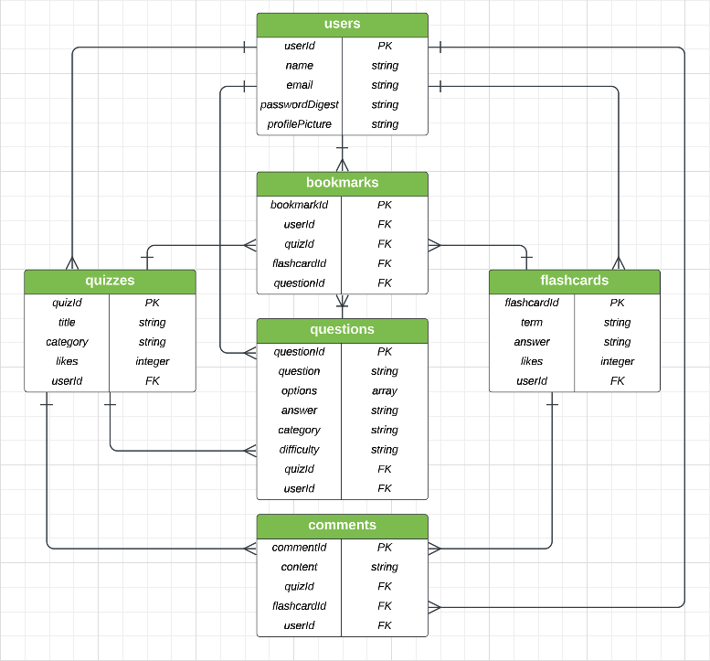

# triviata_app_backend
Backend repo for Triviata app

# Triviata
Triviata is a quiz and flashcard platform that allows users to create and utilize quizzes and flashcards made by others.

## The team

## Describe the app

## ERD

## Models

    
Users

### Users
The Users model will store all data realting to a user's profile. Users create and update their profile information. User fields are: 
- user_id 
- name
- email
- password

### Quizzes
The Quizzes model will store data relating to a quiz. Users can create, update, and delete quizzes. Users can also bookmark and like quizes created by other users. Quiz fields are: 
- quiz_id  
- title 
- category
- likes
- user_id

### Flashcards
The Flashcards model will store data relating to a quiz. Users can create, update, and delete flashcards. Users can also bookmark and like flashcard sets created by other users. Flashcard fields are: 
- flashcard_id  
- term 
- answer
- likes
- user_id
